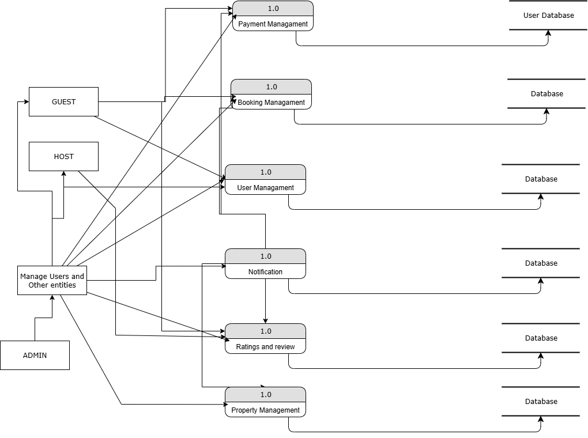

# Airbnb Clone – Data Flow Diagram (DFD)

This directory contains the Data Flow Diagram (DFD) for the Airbnb Clone project. The DFD visually represents how data moves through the system, highlighting the main processes, data stores, and interactions between users and the system.

---

## 📊 Data Flow Diagram



*Figure: High-level DFD showing the main modules, external entities, and data stores in the Airbnb Clone system.*

---

## Purpose

The DFD helps developers, designers, and stakeholders understand the flow of information within the Airbnb Clone system. It is useful for:
- Visualizing system architecture
- Identifying key processes and data stores
- Communicating requirements and design
- Supporting database and API design

---

## Main Modules & Entities

### Modules
1. **Payment Management**: Handles all payment-related processes and interacts with the User Database.
2. **Booking Management**: Manages property bookings for guests and hosts, storing booking data in the database.
3. **User Management**: Manages user registration, authentication, and profile updates.
4. **Notification**: Sends notifications to users about important events (e.g., booking confirmations, payment status).
5. **Ratings and Review**: Allows users to submit and view ratings and reviews for properties and hosts.
6. **Property Management**: Enables hosts and admins to add, edit, or remove property listings.

### External Entities
- **Guest**: Can search, book, review, and manage bookings.
- **Host**: Can manage property listings and respond to bookings.
- **Admin**: Can manage users, properties, and oversee system operations.
- **Manage Users and Other Entities**: Represents admin or system-level management functions.

### Data Stores
- **User Database**: Stores user information and credentials.
- **Database**: Represents other data stores for bookings, properties, payments, reviews, etc.

---

## How to Use This Diagram

1. **Review the DFD image** to understand the high-level data flows and system modules.
2. **Refer to the module breakdowns** in this README for a summary of each process.
3. **Use the DFD as a reference** when designing, developing, or reviewing system features and data interactions.

---

## File List

- `data-flow.png`: The main data flow diagram image (replace with the actual filename if different).
- `README.md`: This documentation file.

---

## Level 3 DFD Examples for All Management Modules

Below are Level 3 Data Flow Diagram (DFD) examples for each major management module in the Airbnb Clone system: Booking Management, Property Management, User Management, and Payment Management.

---

## 1. Booking Management (Level 3)
...existing Level 3 Booking Management example...

---

## 2. Property Management (Level 3)

Entities:
  Host
  Admin

Processes:
  2.1 Add Listing
  2.2 Edit Listing
  2.3 Delete Listing
  2.4 Validate Listing Details
  2.5 Approve/Reject Listing (Admin)

Data Stores:
  D1: Listings DB
  D2: Users DB

Data Flows:
  Host → 2.1 Add Listing → 2.4 Validate Listing Details → 2.5 Approve/Reject Listing → D1: Listings DB
  Host → 2.2 Edit Listing → 2.4 Validate Listing Details → 2.5 Approve/Reject Listing → D1: Listings DB
  Host → 2.3 Delete Listing → D1: Listings DB
  Admin → 2.5 Approve/Reject Listing → D1: Listings DB
  2.1/2.2/2.3 → D2: Users DB (update host profile/listings count)

Diagram (ASCII Art):

  Host
	 |
	 v
 [2.1 Add Listing] / [2.2 Edit Listing] / [2.3 Delete Listing]
	 |
	 v
 [2.4 Validate Listing Details]
	 |
	 v
 [2.5 Approve/Reject Listing] <---- Admin
	 |
	 v
 [D1: Listings DB]
	 |
	 v
 [D2: Users DB] (update host info)

---

## 3. User Management (Level 3)

Entities:
  Guest
  Host
  Admin

Processes:
  3.1 Register User
  3.2 Login User
  3.3 Update Profile
  3.4 Deactivate/Delete User
  3.5 Assign Roles (Admin)

Data Stores:
  D1: Users DB

Data Flows:
  Guest/Host → 3.1 Register User → D1: Users DB
  Guest/Host → 3.2 Login User → D1: Users DB (validate credentials)
  Guest/Host → 3.3 Update Profile → D1: Users DB
  Admin → 3.4 Deactivate/Delete User → D1: Users DB
  Admin → 3.5 Assign Roles → D1: Users DB

Diagram (ASCII Art):

  Guest/Host
	 |
	 v
 [3.1 Register User] / [3.2 Login User] / [3.3 Update Profile]
	 |
	 v
 [D1: Users DB]
	 ^
	 |
 [3.4 Deactivate/Delete User] <---- Admin
	 |
	 v
 [3.5 Assign Roles] <---- Admin

---

## 4. Payment Management (Level 3)

Entities:
  Guest
  Host
  Admin
  Payment Gateway

Processes:
  4.1 Initiate Payment
  4.2 Validate Payment Details
  4.3 Process Payment
  4.4 Record Transaction
  4.5 Refund/Dispute Management

Data Stores:
  D1: Payments DB
  D2: Bookings DB

Data Flows:
  Guest → 4.1 Initiate Payment → 4.2 Validate Payment Details → 4.3 Process Payment → Payment Gateway
  Payment Gateway → 4.4 Record Transaction → D1: Payments DB
  4.4 Record Transaction → D2: Bookings DB (update booking status)
  Admin → 4.5 Refund/Dispute Management → D1: Payments DB

Diagram (ASCII Art):

  Guest
	 |
	 v
 [4.1 Initiate Payment]
	 |
	 v
 [4.2 Validate Payment Details]
	 |
	 v
 [4.3 Process Payment] <----> Payment Gateway
	 |
	 v
 [4.4 Record Transaction] -----> [D1: Payments DB]
	 |
	 v
 [D2: Bookings DB] (update status)
	 ^
	 |
 [4.5 Refund/Dispute Management] <---- Admin

---

These Level 3 DFDs provide detailed breakdowns for each management module, showing sub-processes, data flows, and interactions with data stores and external entities.

---

## Example DFD (Level 3 – Booking Management Process)

Below is a detailed Level 3 DFD example for the Booking Management process in the Airbnb Clone system. This level breaks down the Booking Management process into its sub-processes and shows the flow of data between them, external entities, and data stores.

```
Entities:
  Guest
  Host
  Payment Gateway

Processes:
  3.1 Validate Booking Request
  3.2 Check Property Availability
  3.3 Calculate Booking Cost
  3.4 Process Payment
  3.5 Confirm Booking
  3.6 Send Booking Notifications

Data Stores:
  D1: Listings DB
  D2: Bookings DB
  D3: Payments DB
  D4: Users DB

Data Flows:
  Guest → 3.1 Validate Booking Request → 3.2 Check Property Availability → D1: Listings DB
  3.2 Check Property Availability → 3.3 Calculate Booking Cost
  3.3 Calculate Booking Cost → 3.4 Process Payment → Payment Gateway
  Payment Gateway → 3.4 Process Payment → D3: Payments DB
  3.4 Process Payment → 3.5 Confirm Booking → D2: Bookings DB
  3.5 Confirm Booking → 3.6 Send Booking Notifications → Guest, Host
  3.5 Confirm Booking → D4: Users DB (update user booking history)

Diagram (ASCII Art):

  Guest
	 |
	 v
 [3.1 Validate Booking Request]
	 |
	 v
 [3.2 Check Property Availability] <----> [D1: Listings DB]
	 |
	 v
 [3.3 Calculate Booking Cost]
	 |
	 v
 [3.4 Process Payment] <----> Payment Gateway
	 |
	 v
 [D3: Payments DB]
	 |
	 v
 [3.5 Confirm Booking] -----> [D2: Bookings DB]
	 |
	 v
 [3.6 Send Booking Notifications] -----> Guest, Host
	 |
	 v
 [D4: Users DB] (update booking history)
```

This Level 3 DFD provides a granular view of the Booking Management process, showing how each sub-process interacts with data stores and external entities.