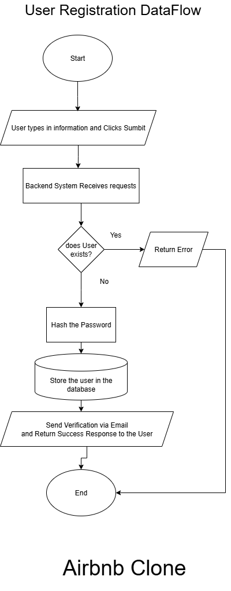

## User Registration Backend Process Flowchart

This flowchart visualizes the backend process for user registration in the system. It outlines the sequence of steps and decision points from the moment a user submits their registration information to the final response from the backend.

### Flowchart Steps

1. **Start**
	- The process begins when a user initiates registration.

2. **User types in information and clicks Submit**
	- The user enters required details (e.g., username, email, password) and submits the registration form.

3. **Backend System Receives Request**
	- The backend server receives the registration data from the frontend.

4. **Does User Exist?**
	- The backend checks if a user with the provided email or username already exists in the database.
	- **If user exists:**
	  - The system returns an error response to the user, indicating that the account already exists.
	- **If user does not exist:**
	  - The process continues to the next step.

5. **Hash the Password**
	- The backend securely hashes the user's password before storing it.

6. **Store the User in the Database**
	- The new user's information (including the hashed password) is saved in the database.

7. **Send Verification via Email and Return Success Response to the User**
	- The system sends a verification email to the user (if applicable) and returns a success response to the frontend.

8. **End**
	- The registration process is complete.

### Notes
- This flow ensures that duplicate accounts are not created and that user credentials are securely handled.
- Sending a verification email is optional and can be customized based on system requirements.

---
This documentation corresponds to the attached flowchart image, providing a clear overview of the backend logic for user registration.
