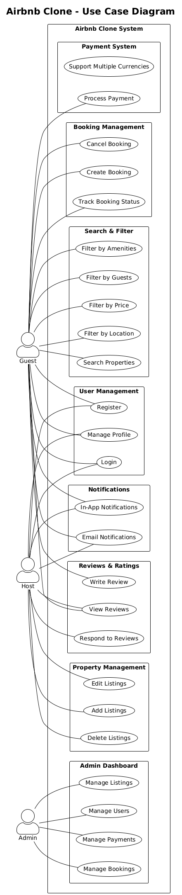

## Airbnb Clone - Use Case Diagram

This directory contains the use case diagram for the Airbnb Clone System, providing a high-level overview of the main functionalities and interactions between different user roles and the system. The diagram visually represents the core features and user flows that are essential for building an Airbnb-like platform.

### Overview

The Airbnb Clone System is designed to facilitate property bookings, user management, payments, reviews, and administrative controls. The system supports three main types of users:

- **Guest**: Users who search for and book properties.
- **Host**: Users who list and manage properties.
- **Admin**: Users who oversee and manage the platform.

### Actors and Their Use Cases

#### 1. Guest
Guests interact with the system to search for properties, filter results, manage bookings, handle payments, and manage their profiles. Their main use cases include:

- **Search & Filter**
	- Search Properties
	- Filter by Amenities
	- Filter by Guests
	- Filter by Price
	- Filter by Location
- **Booking Management**
	- Create Booking
	- Cancel Booking
	- Track Booking Status
- **Payment System**
	- Process Payment
	- Support Multiple Currencies
- **User Management**
	- Register
	- Login
	- Manage Profile
- **Notifications**
	- In-App Notifications
	- Email Notifications
- **Reviews & Ratings**
	- Write Review
	- View Reviews

#### 2. Host
Hosts are responsible for managing property listings and responding to guest reviews. Their main use cases include:

- **Property Management**
	- Add Listings
	- Edit Listings
	- Delete Listings
- **Booking Management**
	- Track Booking Status
- **User Management**
	- Register
	- Login
	- Manage Profile
- **Notifications**
	- In-App Notifications
	- Email Notifications
- **Reviews & Ratings**
	- View Reviews
	- Respond to Reviews

#### 3. Admin
Admins have access to the admin dashboard, where they can manage all aspects of the platform. Their main use cases include:

- **Admin Dashboard**
	- Manage Listings
	- Manage Users
	- Manage Payments
	- Manage Bookings

### System Modules

The system is divided into several modules, each encapsulating related use cases:

- **Payment System**: Handles payment processing and supports multiple currencies.
- **Booking Management**: Manages the creation, cancellation, and tracking of bookings.
- **Search & Filter**: Allows users to search for properties and apply various filters.
- **User Management**: Manages user registration, login, and profile updates.
- **Notifications**: Sends in-app and email notifications to users.
- **Reviews & Ratings**: Enables users to write, view, and respond to reviews.
- **Property Management**: Allows hosts to manage their property listings.
- **Admin Dashboard**: Provides admins with tools to manage the platform.

### How to Use

Refer to the use case diagram image in this directory for a visual representation of the system's actors and use cases. This documentation can be used as a reference for:

- Designing the system architecture
- Implementing features
- Understanding user flows
- Communicating requirements with stakeholders

### File List

- `Airbnb Clone - airbnb_uml.png` (or similar): The use case diagram image.
- `README.md`: This documentation file.

---

For more details on each use case or to contribute to this project, please refer to the main project documentation or contact the project maintainers.

